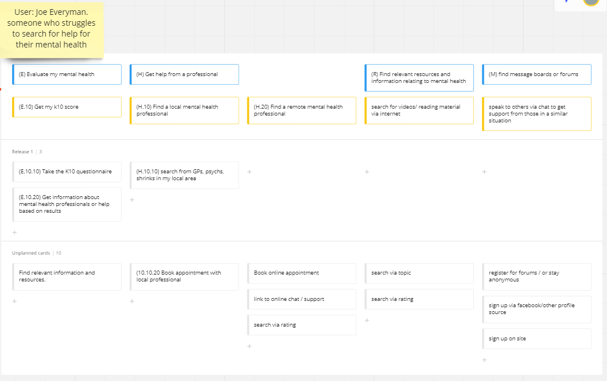
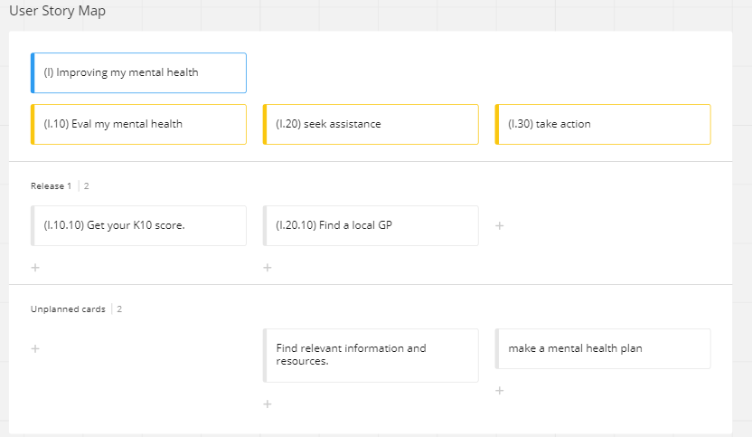
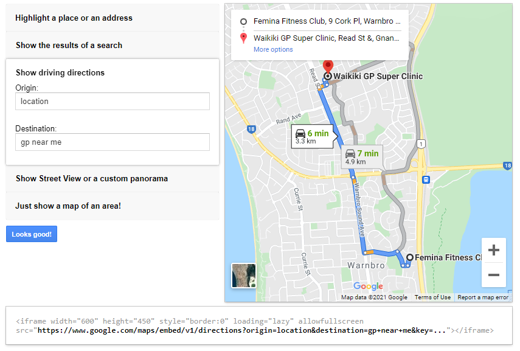

## Group-Project-1
# My Mind Matters 

repo - https://github.com/blmccavanagh/My-Mind-Matters

deployed link - https://blmccavanagh.github.io/My-Mind-Matters/

presentation slides - https://docs.google.com/presentation/d/1WmzmaA0rD3xuZbfTvsrfgXRb5FBdEVHusWMyBWq5yJM/edit#slide=id.g320332ed93_1_0

---

## Description 
My Mind Matters was our first group project. So we created an app around mental health and with the goal for mental health assistance. 

We started out with a user story map: 

But then we simplified the idea:

---
 

## Technologies used:

We used a number of different technologies in this project. we used a new framework Tail   
https://tailwindcss.com/ 
 
it was very easy and simple to use. and it was interesting using a framework over writing all our own css.  
We also used a couple of different apis. One being checkbox survey api 
  
https://www.checkbox.com/ 
  
Now checkbox's interface was great and simple to use too. But after completing the questionnaire it gave us a JSON file to embed. it took us many days of trial and error to work out how to embed this file. there were a lot of resources but we struggled to get any methods we found to work. We've learn how difficult it can be using a new file format were not use to but, We were rather stubborn and got it to work in the end. 
  
we also used the Google Maps Embed API 
 
https://developers.google.com/maps/documentation/embed/get-started 
 
This api was very easy to use it even had a map generator page: https://developers.google.com/maps/documentation/embed/map-generator#testing_your_iframe 

 

 

And we worked out just my entering location and gp near me it worked with our current location it seemd abit buggy sometimes it would show my location sometimes it would show close to my location so we want to research this abit more and make it more accurate.
 

---

