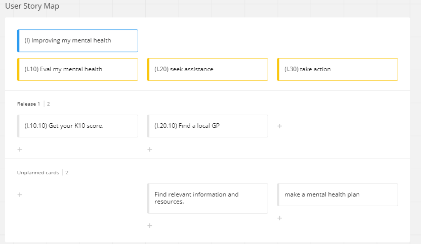
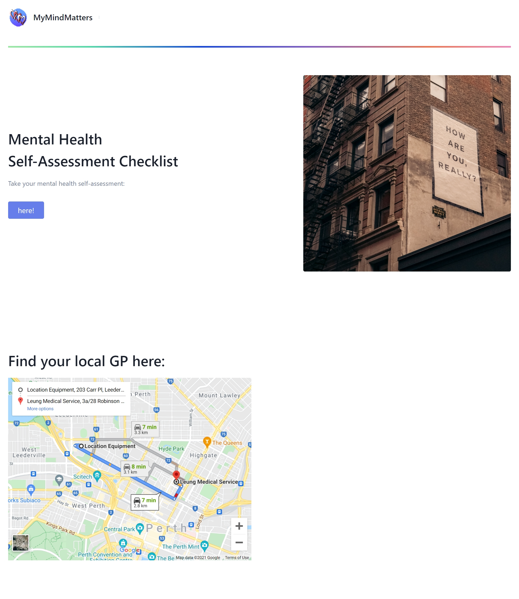
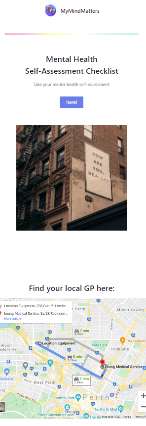
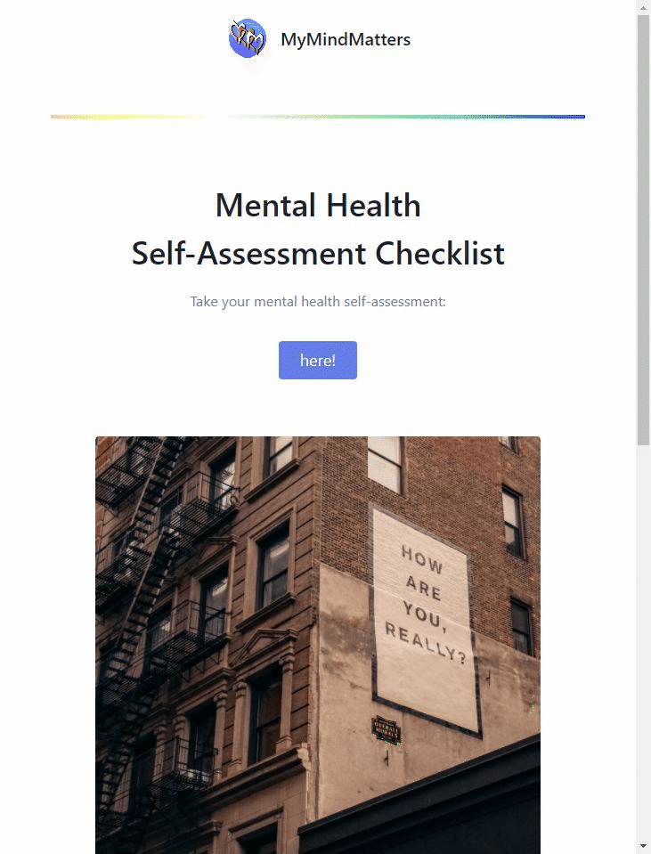

*UWA Coding Bootcamp : Group Project 1*

# My Mind Matters

### This Github repository contains a website built to provide search links to professional help, highlighting the resources that are available in an easy to use and consumable format, and information on how and why to seek help for mental health.
 

## Motivation and Research

The motivation behind the development of My Mind Matters was to provide a comprehensive website that offered information and advice regarding mental health. This website is designed to make this process more manageable, by providing a platform that involves a quick and easy to complete questionnaire that then best matches a users mental health screening results to valuable resources and qualified professionals in their area.

In developing the concept behind My Mind Matters, we researched the current platforms and methods that many Australians are forced to undertake when trying to identify resources to assist them with addressing their mental health concerns, finding the process needlessly complex, with frequently conflicting information and overwhelming the user when they may already be distressed or impacted with mental health issues. From this we created our user story map (see below).

## User Story Map and concept

### **(I) Improving my mental health**

My Mind Matters is designed to reduce the time it takes a person to research into and get help or advice about mental health, and provide an easy-to-navigate user experience that links information associated with mental health to individualised recommendations relating to the type of help they are able to seek, and professional contacts in the field of health and mental health.

### **(I.10) Evaluate my mental health and (I.20) Seek Assistance**

Utilising the industry standard K10 questionnaire that gives the user a result relating to their current state of general distress and recommended next steps, there is a search form that allows the user to select what type of service they are searching for (GP, psychologist, psychiatrist etc.) within their area by entering their postcode. There are also links to recommended reading and video links, categorised by related mental health issues and illnesses.

##  Prototyping and initial development
### Web development technologies 
In developing this website we used a combination of HTML, CSS and a CSS framework, JavaScript, jQuery and web APIs. Technologies include:

* CSS Framework:
    * Tailwind https://tailwindcss.com
* API's
    * Checkbox Survey API: https://www.checkbox.com/
    * The Maps Embed API by Google https://developers.google.com/maps/documentation/embed/get-started
* JavaScript
* JQuery
* K10 Questionaire
    * https://www.hcp.med.harvard.edu/ncs/k6_scales.php

### Graphic design and branding
Initital graphic design work was undertaken on branding, including a design draft of the website logo to be used as the favicon. Suitable complimentary keyframes were utilised in creating an animated gradient with the aim of providing a calming experience for a user visiting the website. 

## Future Development opportunities

We aim to continue to develop the functionality and features of My Mind Matters and have identified the following focus areas for future development or improvement:
* An enhanced design, refining and improving layout, and offering advanced search options and accuracy of geolocation for maps. 
* Links to resources and information across a diverse range of mental health related topics. This will include comprehensive, credible information about treatment, prevention, management and recovery for an extensive range of differing mental disorders; including links to support and emergency / crisis helplines.
* Community engagement opportunities, including forum/message boards, allowing users to share their experiences and provide support for each other.
* Enhancements to the location services and search facilities available. Users will be able to specifically search for health professionals across a range of disciplines, be it GP, psychologist or otherwise, and to choose the location they want to search for this help. This search can be further narrowed by searching for areas of expertise / specialties; such as pediatrics, trauma, relationship counselling etc.
* An evolution of the K10 Questionnaire mental health assessment services with the aim of providing a customised, flexible and adaptive mental health plan, driving user enegagement through the use of notifications and encouraging user interaction.

**Thank you for visiting.**
### Presentation Slides:

* https://docs.google.com/presentation/d/1WmzmaA0rD3xuZbfTvsrfgXRb5FBdEVHusWMyBWq5yJM/edit#slide=id.g320332ed93_1_0

### Repository Link:

* https://github.com/blmccavanagh/My-Mind-Matters

### My Mind Matters - Press Release:

* <a href="./assets/README/mmm-press-release-r1.pdf" download="My Mind Matters - Press Release: Release One">My Mind Matters - Press Release: Release One</a>

### Deployed Application Link:

* https://blmccavanagh.github.io/My-Mind-Matters/

### Application Screenshots:

---

*Desktop Browser View* 

 

---

*Mobile Browser View*

 

---

*Self-Assessment K10 questionnaire Demo*

---